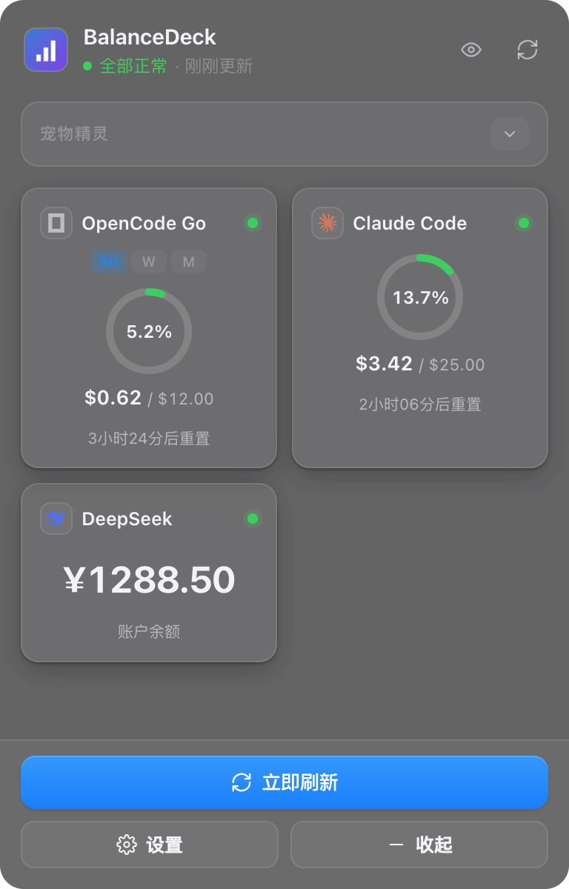

<div align="center">


# BalanceDeck 余额板

**macOS / Windows 常驻桌面的 AI 用量与余额仪表盘**

把散落在各家的 Coding Plan 额度与 API 余额，收进一块可拖动、可收起的悬浮卡片；
菜单栏常驻实时百分比，断网与缓存数据从不伪装成实时数据。

[](#)
[](#)
[](./LICENSE)
[](#测试与验证)

[设计文档](./DESIGN.md) · [任务看板](./TASKS.md) · [问题反馈](https://github.com/CR903/BalanceDeck/issues)

</div>

---

## 为什么需要它

- **额度是分散的**：OpenCode Go、Claude Code、Codex、Copilot 各有一套 5 小时 / 周 / 月限额，
  余额又散在 DeepSeek、Kimi、智谱等控制台里，来回切换成本高。
- **"用了多少"应该一眼可见**：菜单栏直接显示 `5H 5% W 52.9% M 68.5%`，不用打开任何窗口。
- **数据必须诚实**：官方接口不可达时，明确标注「缓存 / 本机估算」，绝不把估算值伪装成实时数据。

## 功能特性

### 🪟 悬浮卡片（主面板）
- **卡片网格**：套餐类渲染为环形仪表（百分比 + 金额 + 重置倒计时），余额类渲染为大号金额卡
- **窗口切换**：同一套餐的 5 小时 / 周 / 月窗口用胶囊标签一键切换，卡片与托盘口径一致
- **余额显隐**：标题栏眼睛按钮一键打码账户余额（收起态圆点同步），适合录屏/投屏场景
- **拖拽排序**：按住卡片拖动即可排序（支持 `⌥←` / `⌥→` 键盘排序），顺序即优先级，决定托盘展示哪一家
- **位置持久化**：拖动位置、收起/展开状态、窗口开合漂移全部持久化并自动夹回工作区（多显示器断开自愈）
- **详情页**：主窗口大环 + 全部窗口明细（百分比 / 金额 / 剩余 / 本机 tokens）+ 每模型用量表（控制台官方口径）

### 🐾 宠物精灵


- **5 只原创 Q 版精灵**：麻薯猫 / 豆柴 / 企鹅仔 / 小恐龙 / 果冻怪（纯 SVG 矢量，无版权风险）
- **伪 3D 光影 + 经典动作**：呼吸、眨眼、摇尾巴、拍翅膀、果冻弹跳，状态差时呈现饥饿 / 失落表情
- **互动与成长**：主面板宠物卡可「撸一把 / 喂食 / 改名 / 换一只」；亲密度与饱食度随时间衰减，等级随经验成长
- **圆点陪伴**：打开开关后，收起的小圆点里就是你的宠物（光环仍是 KPI），**长按 0.6 秒**撸一把
- **数据本地化**：宠物数据仅存本机，支持导出/导入 JSON 一键迁移（换机不丢养成进度）

### 🧭 菜单栏（macOS）/ 系统托盘（Windows）
- **左键**：直接显示 / 隐藏悬浮卡片（macOS 不再被右键菜单抢占）
- **右键**：显示隐藏、立即刷新、退出
- **标题**：平铺展示主供应商的全部时限窗口（`5H 5% W 52.9% M 68.5%`），图标随主供应商 logo 切换
- 离线 / 缓存数据带 `⚠` 前缀，tooltip 显示各家明细

### 🛡️ 数据诚实（断网不撒谎）
- 数据可信度模型：`official`（官方实时）/ `cached`（本轮失败，沿用上次官方值，24h 上限）/ `local`（官方不可达，本机估算）
- 卡片徽章 + 相对时间 + 数字降调；详情页提示条可一键重试；托盘 `⚠`
- 每条窗口明细都标注数据来源（官方 API / 控制台 / 本机统计）

### ✨ 其他
- **5 套内置皮肤**（原生毛玻璃 / 深色科技 / 极简白 / 渐变彩 / 纸感）+ `userData/skins` 外部 CSS 皮肤零代码接入
- **开机自启**：macOS 走 LaunchAgent、Windows 走注册表，设置页即改即存；检测到旧版残留登录项会提示手动清理
- **一键授权**（OpenCode）：内嵌登录窗口自动获取控制台 Cookie，百分比精确到一位小数，与控制台逐位一致
- **隐私优先**：一切数据本地计算与存储，凭据进系统密钥链（Keychain / DPAPI），无遥测

## 支持的供应商

| 类型 | 供应商 | 数据源 |
|---|---|---|
| **Coding Plan** | OpenCode Go | 官方 usage API + 控制台 SSR（精度增强）+ 本机 opencode.db（tokens/每模型） |
| | Claude Code | 本机 `~/.claude/projects/**/*.jsonl` |
| | Codex | 本机 `~/.codex/sessions/**`（服务端 rate_limits 优先） |
| | GitHub Copilot | `copilot_internal/v2/user`（含 premium/chat/completions 配额） |
| **Token Plan** | MiniMax | 官方余额接口（新旧接口自动回退） |
| **API 余额** | DeepSeek / Kimi / 智谱 GLM / 硅基流动 / 通义千问（百炼） / 火山方舟 | 各家官方余额接口（支持自定义 Base URL 走中转） |
| **自定义** | 9 种协议 | DeepSeek 兼容 / Moonshot 兼容 / 智谱兼容 / 硅基流动（国内·国际）/ OpenRouter / OpenAI 计费 / MiniMax Token Plan / 通用 JSON |

> 同一预设可重复添加（多账号 / 多中转站各自独立凭据），可随时启用、禁用、删除。

## 截图



> 演示数据，非真实账户。

## 安装

从 [Releases](https://github.com/CR903/BalanceDeck/releases) 下载（或自行构建，见下文）：

| 平台 | 安装包 |
|---|---|
| macOS | `BalanceDeck-x.y.z.dmg`（拖入「应用程序」即可） |
| Windows | `BalanceDeck Setup x.y.z.exe`（NSIS，可选安装目录） |

首次使用：点击卡片底部「设置」→「添加提供方」选择供应商，填入 API Key；
OpenCode Go 推荐点「一键授权」以获得与控制台一致的精度。

## 使用速查

| 操作 | 效果 |
|---|---|
| 点击菜单栏图标 | 显示 / 隐藏悬浮卡片（macOS 左键；右键弹菜单） |
| 点击卡片 | 进入该供应商详情（窗口明细 + 每模型用量） |
| 按住卡片拖动 | 调整卡片顺序（= 优先级）；`⌥←` / `⌥→` 等效 |
| 卡片上的 `5H` `W` `M` 胶囊 | 切换卡片展示哪个用量窗口 |
| 标题栏眼睛按钮 | 显示 / 隐藏余额（隐私模式） |
| 点击「收起」/ 圆点 | 收起为 56px 圆点 / 展开回卡片 |
| 拖动圆点 | 移动位置（点击与拖动按 8px 阈值区分） |
| 长按圆点 0.6 秒 | 撸宠物一把（需开启「圆点显示宠物」） |
| 宠物卡「导出 / 导入」 | 宠物养成数据 JSON 迁移 |

## 开发

环境要求：Node.js ≥ 22.18（`node:sqlite`）、macOS 12+ / Windows 10+。

```bash
npm install                 # 建议加 ELECTRON_MIRROR=https://npmmirror.com/mirrors/electron/
npm run dev                 # 开发模式（主进程改动静默重启，渲染层热更新）
npm run build               # 构建三端产物（main / preload / renderer）
npm run dist:mac            # 打 macOS dmg + zip
npm run dist:win            # 打 Windows NSIS + zip（可在 macOS 上交叉打包）
```

| 脚本 | 说明 |
|---|---|
| `npm test` | 全部纯函数单元测试（百分比 / SSR 解析 / 数据可信度 / 托盘文案 / 宠物养成） |
| `npm run uitest` | 无头 UI 自动化：卡片 → 详情 → 收起 → 拖拽 → 设置 → 托盘 → 余额显隐 → 窗口切换 → 宠物 → 降级渲染，60 项断言 |
| `npm run shots` | 设计走查截图到 `/tmp/balancedeck-shots/`（含各皮肤圆点、宠物、演示图） |
| `npm run smoke` | 采集一轮并打印快照 JSON 后退出（CI 冒烟） |
| `npm run details:test` | 一次性抓取 OpenCode 控制台每模型明细（排障） |
| `npm run typecheck` | 主进程 / 渲染层全量类型检查 |

## 测试与验证

- **159 项单元断言**：`test:percent` 21 · `test:ssr` 17 · `test:quality` 32 · `test:tray` 29 · `test:pet` 60
- **60 项 UI 断言**：真实 Electron 里跑完整交互链路（含合成指针事件回归拖拽、长按、圆点开合不漂移）
- **设计走查**：`--shots` 自动产出主面板 / 详情 / 设置 / 各皮肤圆点 / 宠物 / 断网缓存态截图
- **兼容性**：Electron 固定 **37.x**（更高版本强链接 macOS 13 的 SMAppService，在 macOS 12 上无法启动）

## 架构

```
主进程 (src/main)                      渲染层 (src/renderer)
├── overlay.ts      悬浮窗 / 收起圆点   ├── CardView       主面板（卡片网格 + 窗口切换 + 宠物卡）
├── tray.ts         菜单栏 / 右键菜单    ├── DetailView     详情（窗口明细 / 每模型表）
├── scheduler.ts    统一频率采集调度     ├── SettingsView   供应商 / 外观 / 频率 / 系统
├── adapters/       11 家内置 + 9 协议   ├── CollapsedDot  收起圆点（宠物 / 长按互动）
├── providers.ts    供应商实例注册表     ├── PetSprites    原创精灵（SVG + CSS 动画）
├── opencode-*.ts   控制台精度 / 明细    └── skins.css     令牌驱动设计系统（5 皮肤）
├── autostart.ts    开机自启（LaunchAgent / 注册表）
└── keystore.ts     凭据加密（safeStorage）
```

更多设计取舍（数据源清单、控制台登录方案、图标网格、拖拽实现细节）见 **[DESIGN.md](./DESIGN.md)**。

## 数据与隐私

- 所有数据**只在本机**计算与存储；除各家余额 / 用量接口外不发起任何网络请求，无遥测
- 凭据通过 Electron `safeStorage` 加密后落盘（macOS Keychain / Windows DPAPI）
- 仓库与示例中不包含任何可用凭据；宠物数据支持导出为本地 JSON，迁移后可随时删除

## Roadmap

- [ ] 额度阈值提醒（>80% 系统通知）
- [ ] 宠物素材包（`userData/pets` 外部精灵加载）
- [ ] 皮肤市场 / 主题包导入导出
- [ ] 国内订阅套餐（GLM Coding Plan / Kimi 会员，实验性）

## 免责声明

BalanceDeck 是第三方工具，与上述任何供应商无从属关系；各商标归其所有者所有。
余额 / 用量数据来自各家公开接口，请以官方控制台为准。

## License

[MIT](./LICENSE)
